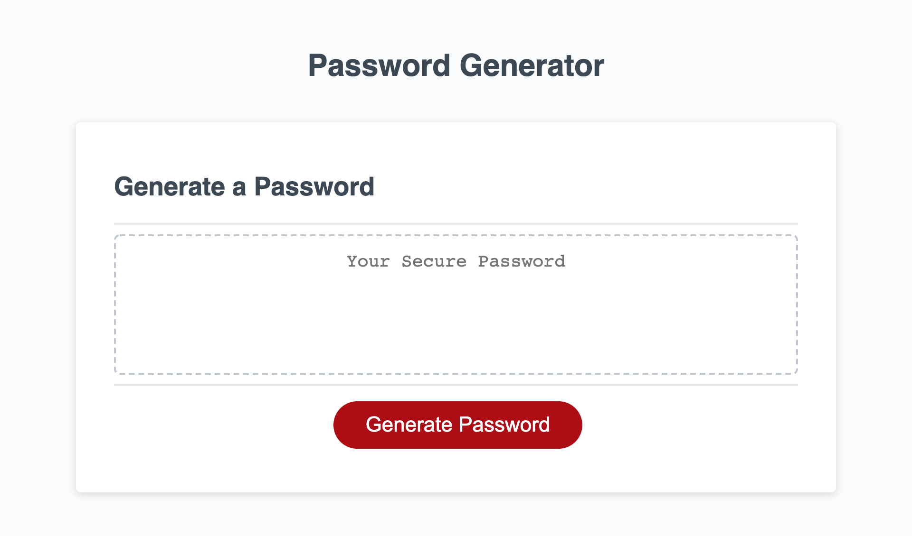

# Password Generator 

## Purpose
This website that you have come to know is a simple random password generator. 

When you 'click' on 'Generate Password', a series of prompts will ask you questions based on the length of your password, if you'd like to add number, lowercase letters, uppercase letters, or special characters. 

    -Special Characters example: ~, #, %, etc.

## Loading Page
When first loading the site, you should be greeted with the following generator:

## Live GitHub Pages
If you'd like to see the site, click [here](https://veroli-mart.github.io/random-password-generator)

## Respository
If you'd like to see the repository itself click [here](https://github.com/veroli-mart/random-password-generator.git)
